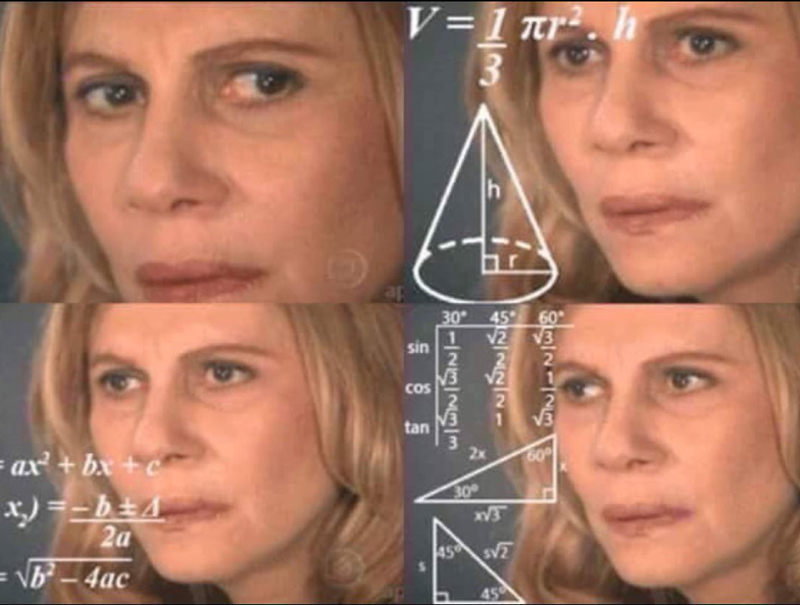

# Golang Intermediate Course: OOP and Concurrency

## Design Patterns

## Support

Open an Issue, I will check it a soon as possible 👀

If you want to hurry me up a bit
[send me a tweet](https://twitter.com/UltiRequiem) 😆

Consider [supporting me on Patreon](https://patreon.com/UltiRequiem) if you like
my work 🙏

Don't forget to start the repo ⭐

## Licence

Licensed under the MIT License 📄
